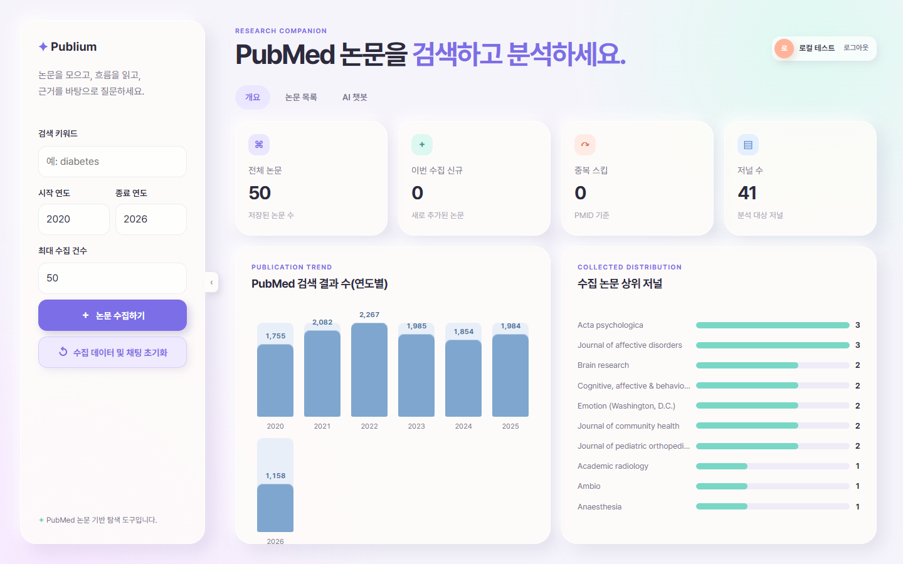
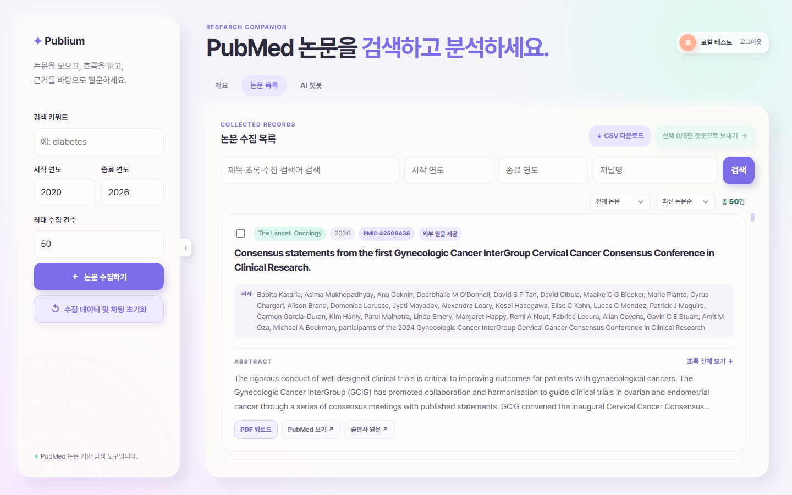
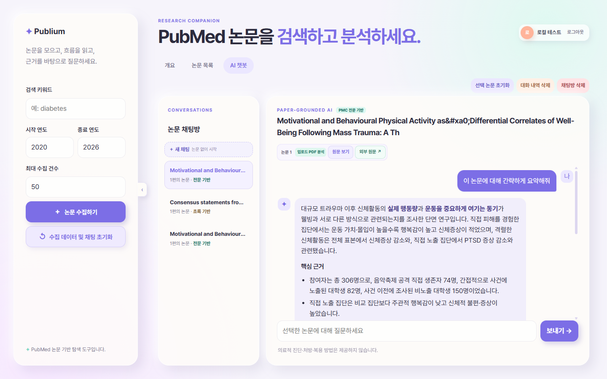
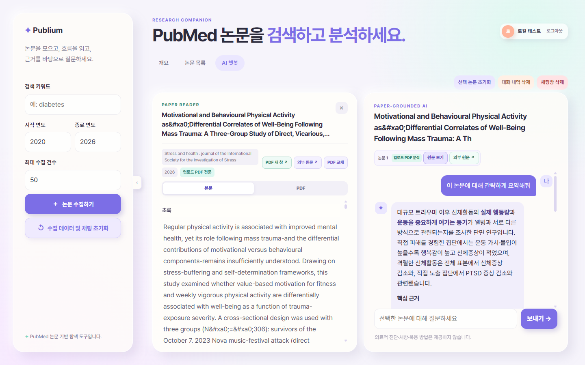
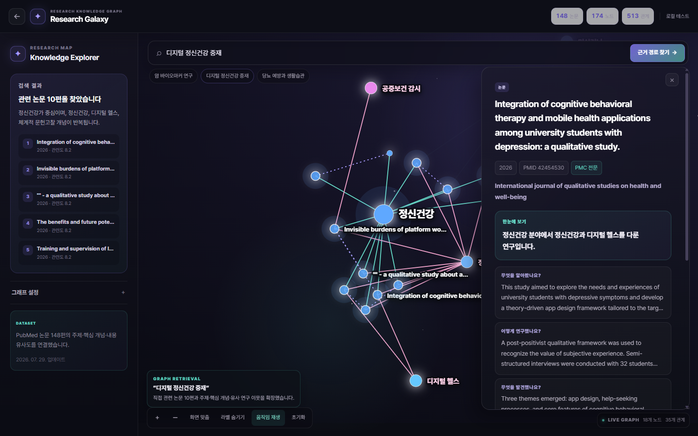
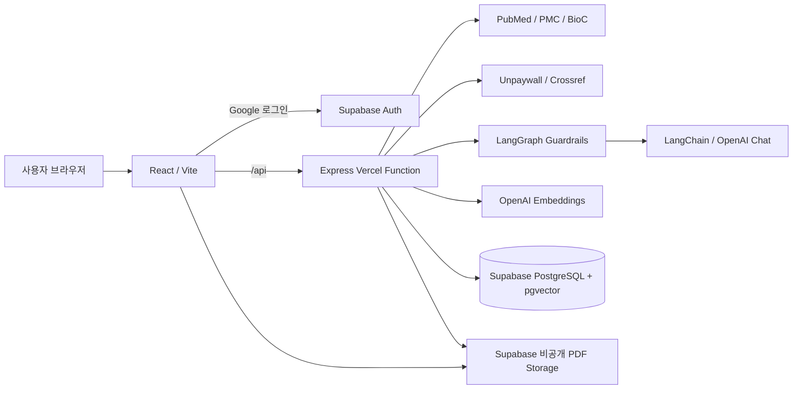

# Publium

> **PubMed 논문을 찾고, 모으고, 읽고, 근거를 확인하며 AI와 대화하는 연구 워크스페이스**

[서비스 바로가기](https://team-pubmed.vercel.app/) ·
[배포 가이드](docs/deployment-renewal.md) ·
[리뉴얼 아키텍처](docs/renewal-architecture.md)

Publium은 여러 사이트와 PDF를 오가며 논문을 정리해야 하는 번거로움을
줄이기 위해 만든 서비스입니다. PubMed 논문 검색부터 초록·공개 전문 수집,
논문별 채팅방, 여러 논문 종합 분석, 관계 중심의 Graph RAG 탐색까지 한
화면에서 처리합니다.

AI가 알고 있는 일반 지식에만 의존하지 않습니다. 선택한 논문의 초록이나
전문에서 관련 근거를 찾아 답변하는 **논문 기반 RAG 챗봇**입니다.



## 프로젝트 한눈에 보기

| 구분 | 내용 |
| --- | --- |
| 해결하려는 문제 | 논문 검색, 원문 확인, 메모와 AI 대화가 서로 다른 도구에 흩어지는 문제 |
| 핵심 흐름 | PubMed 검색 → 초록·전문 저장 → 논문 선택 → 근거 검색 → AI 대화 |
| 차별점 | 답변과 원문을 함께 보고, 실제 근거 문장을 확인하며, 논문 관계를 그래프로 탐색 |
| 구현 범위 | 기획, UI, React 프론트엔드, Express API, DB·RLS, RAG, Vercel 배포 |
| 운영 주소 | <https://team-pubmed.vercel.app/> |
| 배포 방식 | `deploy_vercel` 브랜치에 반영될 때만 Vercel Production 배포 |

### 핵심 구현 포인트

- 검색한 논문의 초록을 즉시 저장해 같은 자료를 매 질문마다 다시 요청하지 않습니다.
- 공개 전문과 사용자 PDF를 청킹·임베딩하고 `pgvector`에서 관련 문단만 검색합니다.
- Paper Reader에서 원문과 채팅을 나란히 열고 답변의 근거 범위를 강조합니다.
- 여러 논문을 한 채팅방에 연결해 공통점과 차이점을 함께 질문할 수 있습니다.
- Research Galaxy는 논문·주제·핵심 개념·내용 유사도를 2D·3D 그래프로 탐색합니다.
- 사용자 컬렉션·채팅·업로드 PDF는 `user_id`, RLS, 서버 검증으로 격리합니다.

## 어떤 사람에게 필요한가요?

- 관심 주제의 최신 PubMed 논문을 빠르게 모으고 싶은 연구자
- 여러 논문의 연구 목적·방법·결과를 비교하고 싶은 학생
- 긴 논문에서 질문과 관련된 문단을 바로 찾고 싶은 사용자
- 답변만 보는 것이 아니라 실제 근거 문장까지 확인하고 싶은 사용자

Publium은 논문 탐색과 연구 보조 도구입니다. 개인의 증상을 진단하거나
약물·복용법을 안내하는 의료 조언 서비스가 아닙니다.

## 무엇을 할 수 있나요?

| 기능 | 설명 |
| --- | --- |
| PubMed 검색 | 키워드, 시작·종료 연도, 최대 건수를 지정해 논문을 검색합니다. 검색 결과는 관심 논문으로 자동 등록되지 않습니다. |
| 검색 메타데이터 저장 | 검색한 논문의 제목, 저자, 저널, 초록, DOI, PMCID를 공용 논문 레코드에 저장합니다. |
| 관심 논문 관리 | 필요한 논문만 직접 추가·해제하고, 해제한 논문은 다시 추가해 복구할 수 있습니다. |
| 연구 프로젝트 분류 | 관심 논문을 프로젝트별로 묶고, 한 논문을 여러 프로젝트에 동시에 연결합니다. |
| 연구 키워드 지도 | 검색 결과 또는 관심 논문의 제목·초록에서 주요 키워드를 찾고, 프로젝트별로 포함 논문 수와 총 등장 횟수를 비교합니다. |
| 연구 현황 대시보드 | 프로젝트별 관심 논문, 미분류 논문, 원문 분석 준비 상태, 최근 검색 추이와 최근 저장 논문을 한눈에 확인합니다. |
| 관심 논문 목록 | 제목·초록·연도·저널로 검색하고 전문 여부와 정렬 기준을 선택합니다. |
| 공개 전문 탐색 | PMC OA, PMC Open Data, BioC, Unpaywall, Crossref에서 원문 후보를 찾습니다. |
| PDF 업로드 | 자동으로 구하지 못한 논문은 사용자가 PDF를 올려 분석할 수 있습니다. |
| 여러 논문 분석 | 최대 5편을 한 채팅방에 넣고 공통점·차이점·종합 결론을 질문합니다. |
| Paper Reader | 논문 원문과 채팅을 50:50으로 열어 함께 읽습니다. |
| 근거 하이라이트 | 답변에 사용된 출처 문장을 표시하고 원문 위치를 강조합니다. |
| Research Galaxy | 실제 PubMed 논문 148편의 주제·핵심 개념·유사 연구 관계와 검색 경로를 시각화합니다. |
| 스트리밍 답변 | AI 답변을 완성될 때까지 기다리지 않고 실시간으로 확인합니다. |
| 사용자별 공간 | Google 로그인, Supabase RLS로 논문 목록과 채팅을 사용자별로 분리합니다. |

## 사용 방법

### 1. PubMed 논문을 검색합니다

왼쪽 검색 영역에서 키워드와 연도 범위를 입력합니다. PubMed 검색 결과의
메타데이터와 초록은 검색 시점에 저장되므로, 이후 질문할 때 PubMed에서
같은 초록을 매번 다시 가져오지 않습니다. 검색된 논문은 사용자 관심 목록에
자동으로 등록되지 않습니다.

개요 화면에서는 다음 정보를 바로 확인할 수 있습니다.

- 현재 관심 논문 수
- 진행 중인 프로젝트와 아직 분류하지 않은 논문 수
- 원문 분석 완료·초록 기반·처리 중 논문 수
- 프로젝트별 관심 논문 분포와 바로가기
- 가장 최근 검색어와 기간이 명시된 PubMed 전체 검색 추이
- 최근 저장한 관심 논문 3편과 프로젝트 분류 상태
- 미분류 정리·프로젝트 확인·AI 채팅용 논문 선택 바로가기

### 2. 필요한 논문만 관심 논문으로 등록합니다

`검색 결과` 탭에서 보관할 논문의 `관심 논문 추가` 버튼을 누릅니다.
관심 해제는 데이터를 물리적으로 지우지 않고 `is_del` 상태를 변경하며,
같은 논문을 다시 추가하면 기존 행이 복구됩니다.

### 3. 관심 논문 목록에서 분석 대상을 고릅니다

논문 카드에서 초록, 저자, 저널, 출판 연도, PMID를 확인할 수 있습니다.
PubMed·출판사 원문으로 이동하거나 PDF를 직접 업로드할 수도 있습니다.

상단에서 연구 프로젝트를 만들고 `전체 / 프로젝트별 / 미분류` 목록을
전환할 수 있습니다. 논문 카드의 `프로젝트 분류`에서 여러 프로젝트를
동시에 선택합니다. 목록의 논문을 여러 편 선택하면 프로젝트를 일괄 추가하거나
기존 분류를 한 번에 교체할 수도 있습니다. 기존 관심 논문은 프로젝트를
지정하기 전까지 `미분류`로 표시됩니다.

프로젝트는 논문 메타데이터나 임베딩을 복사하지 않고 연결 정보만 저장합니다.
프로젝트를 삭제해도 관심 논문은 유지되며, 프로젝트와 연결 정보는
`is_del` 기반으로 보관 처리되어 바로 되돌릴 수 있습니다.

`연구 키워드`를 열면 현재 프로젝트의 모든 활성 관심 논문을 제목+초록
기준으로 분석합니다. 글자 크기는 여러 논문에 걸친 확산 정도와 반복 횟수,
제목 등장 여부를 함께 반영하며, 상위 목록에는 `포함 논문 수 · 총 등장 횟수`를
정확한 숫자로 표시합니다. 원문과 OpenAI API는 이 계산에 사용하지 않습니다.



목록에서는 다음 조건을 조합할 수 있습니다.

- 제목·초록
- 시작·종료 연도
- 저널명
- 전체 논문 / 전문 분석 가능 / 초록 기반
- 최신순 / 오래된순 / 최근 관심 등록순 / 제목순

분석할 논문은 최대 5편까지 선택할 수 있습니다. 선택한 논문을 챗봇으로
보내면 해당 논문 조합을 위한 별도의 채팅방이 생성됩니다.

### 4. 선택한 논문에 대해 질문합니다

챗봇은 채팅방에 연결된 논문만 근거로 답변합니다. 여러 논문을 선택했다면
각 논문의 개요와 관련 문단을 함께 검색해 종합합니다.

예를 들어 다음과 같이 질문할 수 있습니다.

- 이 논문의 연구 목적과 결론을 간단히 정리해줘.
- 연구 대상과 사용한 방법을 설명해줘.
- 선택한 세 논문의 공통점과 차이점을 비교해줘.
- 결과를 뒷받침하는 실제 근거 문장을 보여줘.
- 연구의 한계와 후속 연구 아이디어를 정리해줘.



논문 없이 일반 채팅방을 만들 수도 있지만, 논문 근거가 필요한 질문은
반드시 논문을 연결한 채팅방에서 진행해야 합니다.

### 5. 원문과 답변을 함께 확인합니다

`원문 보기`를 누르면 Paper Reader가 왼쪽, 채팅이 오른쪽에 열립니다.
PDF와 추출 본문을 전환하면서 답변에 사용된 근거를 확인할 수 있습니다.



`외부 원문`은 PMC·DOI·출판사 페이지를 새 창으로 엽니다. 외부 페이지는
서비스가 제어할 수 없으므로 Publium의 근거 하이라이트는 Paper Reader에
저장된 본문에서 제공합니다.

### 6. Research Galaxy에서 연구 관계를 탐색합니다

`지식 그래프` 메뉴는 독립된 전체 화면에서 실제 PubMed 논문 148편의
관계를 보여줍니다. 암 정밀의료, 심혈관 건강, 뇌·신경과학,
대사·당뇨, 정신건강, 공중보건의 여섯 분야로 구성했습니다.



#### 그래프에는 무엇이 표시되나요?

| 구성 요소 | 의미 |
| --- | --- |
| 연구 주제 노드 | 암 정밀의료, 심혈관 건강 등 6개 연구 분야의 중심점 |
| 논문 노드 | 실제 PubMed 논문 148편. 화면에는 `P001` 같은 식별자로 간결하게 표시 |
| 핵심 개념 노드 | 질환, 치료법, 바이오마커, 연구 방법처럼 여러 논문에서 반복되는 개념 |
| 주제 연결 | 논문이 어떤 연구 분야에 속하는지 표시 |
| 개념 연결 | 제목과 초록에서 발견한 핵심 개념이 어떤 논문과 연결되는지 표시 |
| 유사 논문 연결 | 같은 분야에서 제목·초록의 주요 용어가 가까운 논문을 연결 |

#### 질문이 그래프 탐색 결과가 되는 과정

1. 사용자가 가운데 검색창에 자연어 연구 질문을 입력합니다.
2. 질문의 주요 용어를 논문 제목·초록·한국어 요약과 비교해 관련 논문을 찾습니다.
3. 검색된 논문뿐 아니라 연결된 연구 주제와 핵심 개념, 유사 논문 이웃까지 확장합니다.
4. 관련 노드와 연결선을 강조하고 왼쪽 패널에 관련 논문 목록을 표시합니다.
5. 논문을 선택하면 오른쪽 패널에서 원문 제목, 저자, 저널, PMID, 초록 기반 요약과 연결 이유를 확인합니다.
6. 두 논문을 지정하면 중간의 주제·개념 노드를 포함한 최단 연결 경로를 계산합니다.

#### 지식 그래프 탭에서 할 수 있는 일

- 논문, 연구 주제, 질환·치료·연구 방법·바이오마커 개념을 서로 다른 노드로 표시
- 헤더의 `2D / 3D` 버튼으로 평면 탐색과 회전 가능한 공간 그래프를 전환
- 왼쪽 `논문 노드 찾기`에서 그래프 식별자, PMID, 원문 제목, 저자, 저널로 특정 논문을 바로 선택
- 같은 분야에서 제목·초록 용어가 유사한 논문 연결
- 전체·논문 중심·전문 가능·근거 경로 렌즈
- 은하형·클러스터형 배치 전환
- 물리 기반 노드 움직임과 주변 관계가 함께 반응하는 드래그
- 확대·축소·이동, 움직임 일시정지와 1·2단계 관계 강조
- 두 논문 사이의 최단 연결 경로 탐색
- 자연어 질문의 관련 논문을 찾고 주제·핵심 개념·유사 연구 이웃까지 확장
- 그래프의 논문 노드는 `P001` 같은 짧은 식별자로 표시하고, 마우스를 올리면 원문 제목·연도·연구 분야·가장 강한 연결 근거 제공
- 좌우 패널에서는 논문 제목을 원문 그대로 모두 표시
- 선택 논문의 한줄 요약, 연구 목적·방법·결과는 초록을 근거로 한국어로 제공하고 관련 논문별 연결 이유도 함께 표시

#### 이것도 RAG인가요?

현재 구현은 **Graph Retrieval + Visualization** 단계입니다. 질문과 관련된
논문을 검색한 뒤 그래프 이웃을 확장해 근거가 어떤 연구 주제와 개념을 통해
연결되는지 보여주므로 Graph RAG의 검색 구조를 사용합니다.

다만 일반적인 Graph RAG의 마지막 단계처럼 검색된 서브그래프를 LLM에
전달해 새로운 답변을 생성하지는 않습니다. `AI 챗봇` 탭은 운영 DB와
`pgvector`를 이용한 벡터 RAG이고, `지식 그래프` 탭은 별도의 고정 코퍼스로
관계와 검색 경로를 설명합니다.

```text
지식 그래프 탭
질문 → 관련 논문 검색 → 주제·개념·유사 논문 확장 → 관계 경로 시각화

AI 챗봇 탭
질문 → 임베딩 생성 → pgvector 청크 검색 → 관련 문단을 LLM에 전달 → 답변 생성
```

이 구조를 분리한 이유는 포트폴리오용 그래프 코퍼스가 사용자의 개인 논문,
채팅, 업로드 PDF와 섞이지 않게 하고 기능별 동작을 명확하게 보여주기
위해서입니다. 이후에는 선택한 서브그래프와 연결 이유를 챗봇 컨텍스트에
추가하는 방식으로 완전한 Graph RAG 답변 생성 단계까지 확장할 수 있습니다.

## 논문 전문은 어떻게 가져오나요?

Publium은 권리가 확인되지 않은 유료 출판사 본문을 무단으로 크롤링하지
않습니다. 실제 분석에 사용할 수 있는 본문을 다음 순서로 확보합니다.

| 경로 | 역할 | 자동 분석 여부 |
| --- | --- | --- |
| PMC Open Data | 공개 JATS XML·PDF·텍스트 탐색 | 공개 라이선스 확인 후 분석 |
| NCBI EFetch | PMCID로 PMC XML 요청 | 공개 라이선스 확인 후 분석 |
| BioC | PMC 본문을 구조화된 JSON으로 요청 | PMC 라이선스 확인 후 분석 |
| Unpaywall | DOI의 합법적인 공개 원문 위치 탐색 | 링크·PDF 후보 저장 |
| Crossref | DOI·출판사 원문 후보 탐색 | 링크 후보만 저장 |
| 사용자 PDF | 사용자가 보유한 PDF 업로드 | 사용자 전용으로 분석 |
| PubMed 초록 | 전문을 구하지 못했을 때의 마지막 근거 | 초록 범위에서 답변 |

실제 근거 우선순위는 다음과 같습니다.

```text
사용자 업로드 PDF
  → DB에 저장된 PMC 공개 전문
  → PMC XML
  → BioC 본문
  → PubMed 초록
```

중요한 차이가 있습니다.

- **원문 링크 발견**: 읽을 수 있는 외부 위치를 찾은 상태
- **전문 분석 완료**: 본문을 추출하고 청킹·임베딩하여 DB에 저장한 상태

Unpaywall이나 Crossref에서 링크를 찾았다는 이유만으로 그 PDF를 자동
다운로드하거나 임베딩하지 않습니다. PMC XML·BioC 본문 또는 사용자가
업로드한 PDF처럼 실제 텍스트를 확보한 경우에만 전문 RAG가 준비됩니다.

### PDF 업로드 제한

- 파일 형식: PDF
- 최대 크기: 25MB
- 최대 페이지: 2,000페이지
- 최대 추출 텍스트: 3,500,000자
- 저장 위치: Supabase 비공개 `paper-pdfs` bucket
- 접근 범위: 업로드한 사용자 본인

현재 OCR은 지원하지 않습니다. 글자를 드래그할 수 없는 스캔 이미지 PDF는
텍스트를 추출할 수 없어 분석 대상이 되지 않습니다.

## RAG는 어떻게 동작하나요?

RAG는 AI가 논문 전체를 외우게 만드는 방식이 아닙니다. 질문이 들어올 때
DB에서 관련 문단을 찾아 AI에게 참고 자료로 전달하는 방식입니다.

```text
논문 전문 확보
  → 섹션별 본문 정리
  → 작은 청크로 분리
  → 청크 임베딩 생성
  → PostgreSQL + pgvector 저장

사용자 질문
  → 질문 임베딩 생성
  → 의미가 가까운 논문 청크 검색
  → 논문 개요 + 검색된 근거를 AI에 전달
  → LangGraph 입력 가드 → LangChain 답변 생성 → 출력 가드
  → 검증된 답변을 SSE로 전달
  → 출처 문장과 하이라이트 표시
```

쉽게 말하면 논문마다 **의미 기반 색인**을 미리 만들어 두고, 질문할 때
필요한 부분만 빠르게 펼쳐 보는 구조입니다.

### 청킹과 벡터 검색 기준

- 청크 크기: 최대 약 4,200자
- 청크 중복: 약 400자
- 임베딩 모델: `text-embedding-3-small`
- 벡터 크기: 1,536차원
- 벡터 저장소: Supabase PostgreSQL의 `pgvector`
- 거리 기준: 코사인 거리
- 검색 인덱스: HNSW
- 기본 검색량: 논문별 최대 2개, 전체 약 10개 청크

별도의 Pinecone 같은 벡터 DB를 운영하지 않습니다. PostgreSQL 안에서 일반
데이터와 벡터를 함께 관리합니다.

| 문서 종류 | 원문 테이블 | 청크·벡터 테이블 | 데이터 범위 |
| --- | --- | --- | --- |
| PMC 공개 전문 | `paper_documents` | `paper_chunks` | 여러 사용자가 재사용하는 공용 캐시 |
| 사용자 PDF | `user_paper_documents` | `user_paper_chunks` | 업로드한 사용자 전용 |

질문을 임베딩할 수 없거나 pgvector 검색이 실패해도 채팅 전체를 중단하지
않습니다. 이 경우 논문별 앞쪽 청크를 순서대로 가져오는 결정적 fallback을
사용합니다. 다만 의미 유사도 검색보다 근거 선택 정확도가 낮을 수 있습니다.

전문이 없는 논문은 제목·저널·출판 연도·초록을 논문 개요로 AI에 직접
전달합니다. 초록은 현재 전문처럼 벡터 청킹하지 않으므로, 초록에 없는
세부 방법이나 결과까지 답할 수는 없습니다.

## 전체 시스템 구조



| 영역 | 기술 | 실행 환경 |
| --- | --- | --- |
| Frontend | React 19, Vite | Vercel Static Build |
| Backend | Node.js 22, Express | Vercel Function |
| Auth | Supabase Auth, Google OAuth | Supabase |
| Database | PostgreSQL, pgvector, RLS | Supabase |
| PDF Storage | Supabase Storage | 비공개 bucket |
| 논문 데이터 | PubMed E-utilities, PMC, BioC | NCBI |
| 원문 탐색 | PMC OA, Unpaywall, Crossref | 외부 API |
| AI | LangChain.js, LangGraph.js, OpenAI Chat·Embeddings, SSE | Vercel Function |

챗봇은 LangGraph 상태 그래프로 입력 검사, 컨텍스트 준비, LangChain 모델
호출, 출력 검사를 순서대로 실행합니다. 개인 의료 조언과 프롬프트 탈취
요청은 검색·모델 호출 전에 차단하고, 이메일·전화번호·API 키·토큰은 모델에
전달하기 전에 마스킹합니다. 모델의 전체 답변도 다시 검사한 뒤 안전한
응답만 SSE로 전달합니다.

## 주요 설계 결정

| 결정 | 이유 |
| --- | --- |
| PostgreSQL과 `pgvector`를 함께 사용 | 일반 데이터와 벡터를 한 DB에서 관리해 권한과 백업 구조를 단순화 |
| 공개 전문과 사용자 PDF 분리 | PMC 공개 문서는 공용 캐시로 재사용하고, 업로드 PDF는 소유자만 접근 |
| 초록을 검색 시점에 저장 | PubMed 재호출을 줄이고 전문이 없을 때도 최소한의 논문 근거를 유지 |
| 문서 전체 대신 관련 청크 전달 | 질문마다 긴 원문을 다시 읽는 비용을 줄이고 근거 위치를 추적 |
| 검증 후 SSE 응답 | 전체 답변의 안전성을 검사한 뒤 기존 SSE 계약으로 화면에 전달 |
| `is_del` 소프트 삭제 | 사용자 초기화와 채팅 삭제 기록을 복구 가능한 상태로 보존 |
| Graph RAG 코퍼스 분리 | 운영 사용자 데이터와 시연용 연구 그래프를 섞지 않고 안정적으로 제공 |
| Vercel same-origin API | 프론트엔드와 API를 한 도메인에서 제공해 CORS와 배포 구성을 단순화 |

Research Galaxy는 현재 고정 코퍼스의 관계 탐색과 검색 경로 시각화에
집중합니다. 실제 논문 채팅은 운영 DB의 벡터 RAG가 담당하며, 그래프에서
찾은 관계를 LLM 답변 생성에 직접 주입하는 단계는 아직 연결하지 않았습니다.

## 프로젝트 구조

```text
team-pubmed/
├── api/
│   └── index.js              # Vercel Function 진입점
├── client/
│   ├── src/                  # React 화면, Research Galaxy, API 클라이언트
│   │   └── data/             # Graph RAG 데모용 PubMed 코퍼스
│   ├── public/               # 정적 자산
│   └── .env.example          # 브라우저 공개 환경변수 예시
├── server/
│   ├── src/                  # Express, 인증, PubMed, RAG, OpenAI
│   ├── test/                 # Node 단위·API 테스트
│   └── .env.example          # 서버 전용 환경변수 예시
├── shared/
│   └── wordCloud.js          # 브라우저·서버가 공유하는 제목+초록 전처리와 점수 계산
├── supabase/
│   └── schema.sql            # 테이블, RLS, pgvector, Storage 정책
├── docs/
│   ├── images/               # README 화면 캡처
│   ├── renewal-architecture.md
│   └── deployment-renewal.md
├── scripts/                  # DB 적용·검증·그래프 코퍼스 생성 스크립트
├── templates/                # 기존 Jinja 화면 비교 기준
├── static/                   # 기존 CSS·JavaScript 비교 기준
├── tests/                    # 기존 FastAPI 회귀 테스트
├── package.json              # npm workspace와 공통 명령
└── vercel.json               # Vercel 빌드·라우팅·배포 브랜치
```

기존 FastAPI/Jinja 구현은 디자인과 동작 비교 기준으로 보존합니다. 현재
Vercel 배포 애플리케이션은 `client/`, `server/`, `api/`를 사용합니다.

## 로컬에서 실행하기

### 사전 준비

- Node.js 22
- npm
- Supabase 프로젝트
- OpenAI API key

저장소를 받은 뒤 루트에서 실행합니다.

```powershell
npm install
Copy-Item client\.env.example client\.env
Copy-Item server\.env.example server\.env
```

루트 `.env.example`은 클라이언트와 서버의 환경변수 경계를 설명하는 안내
파일입니다. 실제 애플리케이션은 `client/.env`와 `server/.env`를 읽습니다.

### Supabase 스키마 적용

Supabase Dashboard의 SQL Editor에서
[`supabase/schema.sql`](supabase/schema.sql)을 실행합니다.

다음 항목이 함께 생성됩니다.

- 사용자 프로필과 검색·논문 컬렉션
- 논문 메타데이터·초록
- PMC 공용 문서와 벡터 청크
- 사용자 PDF 문서와 벡터 청크
- 채팅방·메시지·논문 연결
- pgvector와 HNSW 인덱스
- 사용자별 RLS 정책
- 비공개 `paper-pdfs` Storage bucket 정책

### 클라이언트 환경변수

[`client/.env.example`](client/.env.example)을 복사해 사용합니다.

```dotenv
VITE_API_URL=
VITE_SUPABASE_URL=https://your-project.supabase.co
VITE_SUPABASE_ANON_KEY=your-anon-or-publishable-key
```

`VITE_API_URL`은 로컬과 Vercel에서 비워 두는 것이 기본입니다.

- 로컬: Vite proxy가 `/api`를 `http://127.0.0.1:4000`으로 전달
- Vercel: 같은 배포의 `/api` Function 호출

`VITE_*` 값은 브라우저 번들에 포함됩니다. service-role key, DB 비밀번호,
OpenAI key 같은 비밀값을 넣으면 안 됩니다.

### 서버 환경변수

[`server/.env.example`](server/.env.example)을 복사해 사용합니다.

| 변수 | 필수 | 설명 |
| --- | --- | --- |
| `NODE_ENV` | 예 | 로컬은 `development`, 운영은 Vercel 설정 사용 |
| `PORT` | 예 | 로컬 Express 포트, 기본값 `4000` |
| `CLIENT_ORIGIN` | 예 | 허용할 브라우저 origin, 여러 개면 쉼표로 구분 |
| `DATABASE_URL` | 예 | Supabase PostgreSQL 연결 문자열 |
| `DATABASE_SSL` | 예 | Supabase 연결 시 `true` |
| `SUPABASE_URL` | 예 | Supabase Project URL |
| `SUPABASE_SERVICE_ROLE_KEY` | 예 | 서버 전용 service-role/secret key |
| `OPENAI_API_KEY` | AI 사용 시 | 채팅과 임베딩 호출용 |
| `OPENAI_CHAT_MODEL` | 예 | 채팅 모델 |
| `OPENAI_EMBEDDING_MODEL` | 예 | 기본값 `text-embedding-3-small` |
| `NCBI_EMAIL` | 권장 | NCBI 요청 식별용 이메일 |
| `NCBI_API_KEY` | 선택 | NCBI 호출 한도 확장 |
| `NCBI_TOOL` | 예 | NCBI 요청 도구명, 기본값 `publium` |
| `UNPAYWALL_EMAIL` | 권장 | Unpaywall API 연락 이메일 |
| `DEV_USER_ID` | 로컬 선택 | Google 로그인 없는 전용 로컬 테스트 계정 UUID |

Vercel에서는 연결 수가 제한된 direct DB 주소보다 Supabase transaction
pooler URL을 권장합니다. DB 비밀번호에 특수문자가 있으면 URL encoding된
연결 문자열을 사용합니다.

### 개발 서버 실행

```powershell
npm run dev
```

- Frontend: <http://localhost:5173>
- API health: <http://localhost:4000/api/health>

정상이라면 health endpoint가 다음 값을 반환합니다.

```json
{"status":"ok"}
```

### Google 로그인 없이 로컬 테스트

1. Supabase Authentication에 `local-dev@publium.local` 사용자를 만듭니다.
2. 생성된 사용자 UUID를 `server/.env`의 `DEV_USER_ID`에 입력합니다.
3. 서버를 다시 시작합니다.
4. <http://localhost:5173/?dev=1>로 접속합니다.

로컬 인증 우회는 `NODE_ENV=development`이면서 Vercel이 아닐 때만
작동합니다. 운영 계정 UUID를 `DEV_USER_ID`로 사용하면 안 됩니다.

## Google OAuth 설정

Supabase에서 Google provider를 활성화하고 아래 URL을 등록합니다.

```text
Supabase Site URL:
https://<VERCEL_PRODUCTION_DOMAIN>

Supabase Redirect URLs:
http://localhost:5173/**
https://<VERCEL_PRODUCTION_DOMAIN>/**

Google OAuth Authorized redirect URI:
https://<SUPABASE_PROJECT_REF>.supabase.co/auth/v1/callback
```

Google Cloud에는 Vercel 주소가 아니라 Supabase callback URL을 Authorized
redirect URI로 등록합니다. 로그인 완료 후 사용자를 돌려보낼 최종 주소는
Supabase의 Site URL과 Redirect URLs에서 관리합니다.

## 자주 사용하는 명령

| 명령 | 역할 |
| --- | --- |
| `npm run dev` | 클라이언트와 서버 동시 실행 |
| `npm run dev:client` | Vite 클라이언트만 실행 |
| `npm run dev:server` | Express 서버만 실행 |
| `npm run build` | React 프로덕션 빌드 |
| `npm run test` | 서버 테스트 |
| `npm run check` | 서버 테스트와 클라이언트 빌드 전체 검증 |
| `npm run start` | Express 서버 실행 |
| `node scripts/generate-research-graph.mjs` | PubMed에서 Research Galaxy 데모 코퍼스 재생성 |
| `node scripts/generate-research-graph-summaries.mjs` | 코퍼스 초록을 근거로 Research Galaxy 한국어 요약 생성 |

## 데이터와 보안 원칙

- 사용자별 논문 컬렉션·채팅·업로드 PDF를 인증된 사용자 ID로 제한합니다.
- Supabase RLS로 브라우저의 다른 사용자 데이터 접근을 차단합니다.
- PDF 원본은 공개 URL이 아닌 만료되는 signed URL로 제공합니다.
- 서버 비밀값은 Vercel Function에서만 사용합니다.
- `DATABASE_URL`, `SUPABASE_SERVICE_ROLE_KEY`, `OPENAI_API_KEY`,
  `NCBI_API_KEY`에는 절대로 `VITE_` 접두어를 붙이지 않습니다.
- 사용자·업무 데이터 초기화는 `is_del` 기반 소프트 삭제를 기본으로 합니다.
- 라이선스가 확인되지 않은 출판사 본문은 서버에 저장하지 않습니다.

## 현재 제한 사항

- 스캔 이미지 PDF OCR 미지원
- 유료 출판사 PDF 자동 다운로드 미지원
- Unpaywall·Crossref PDF 후보의 자동 파싱·임베딩 미지원
- 초록 기반 논문은 초록에 없는 세부 내용을 답할 수 없음
- 외부 원문 페이지 안의 직접 하이라이트 미지원
- Research Galaxy는 고정된 148편의 시연 코퍼스이며 운영 논문 전체를 반영하지 않음
- Research Galaxy는 검색 경로 시각화 단계이며 그래프 기반 LLM 답변 생성은 미연결
- AI 답변은 논문 해석 보조용이며 연구자의 원문 검토를 대체하지 않음

## 검증

```powershell
npm run check
```

현재 검증 항목에는 다음 내용이 포함됩니다.

- 인증과 로컬 테스트 계정 제한
- CORS와 Vercel same-origin 요청
- PubMed XML 파싱
- PMC/BioC 본문 파싱
- 청킹과 여러 논문의 근거 균형
- 출처 문장 선택과 하이라이트 범위
- LangGraph 입력·출력 가드와 민감정보 마스킹
- 사용자별 초기화와 소프트 삭제
- React 프로덕션 빌드

## Vercel 배포

| 설정 | 값 |
| --- | --- |
| Framework Preset | Vite |
| Root Directory | `.` |
| Install Command | `npm install` |
| Build Command | `npm run build` |
| Output Directory | `client/dist` |
| Production Branch | `deploy_vercel` |
| Function entry | `api/index.js` |
| Node.js | 22.x |

브랜치 흐름:

```text
renewal → main → deploy_vercel → Vercel Production
```

`vercel.json`에서 `deploy_vercel` 이외 브랜치의 Git 자동 배포를
차단합니다. 따라서 `renewal`과 `main`에 푸시해도 운영 배포는 발생하지
않으며, 검증된 `main`을 `deploy_vercel`에 반영할 때만 배포됩니다.

환경변수, OAuth, 배포 확인과 롤백 절차는
[`docs/deployment-renewal.md`](docs/deployment-renewal.md)를 참고하세요.
